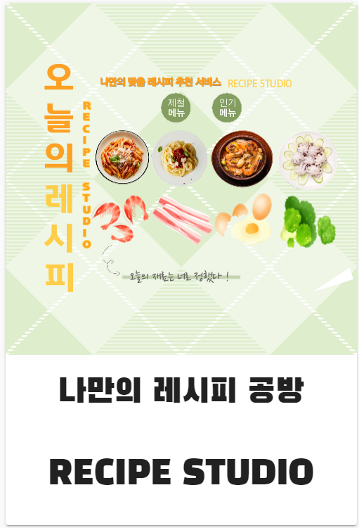
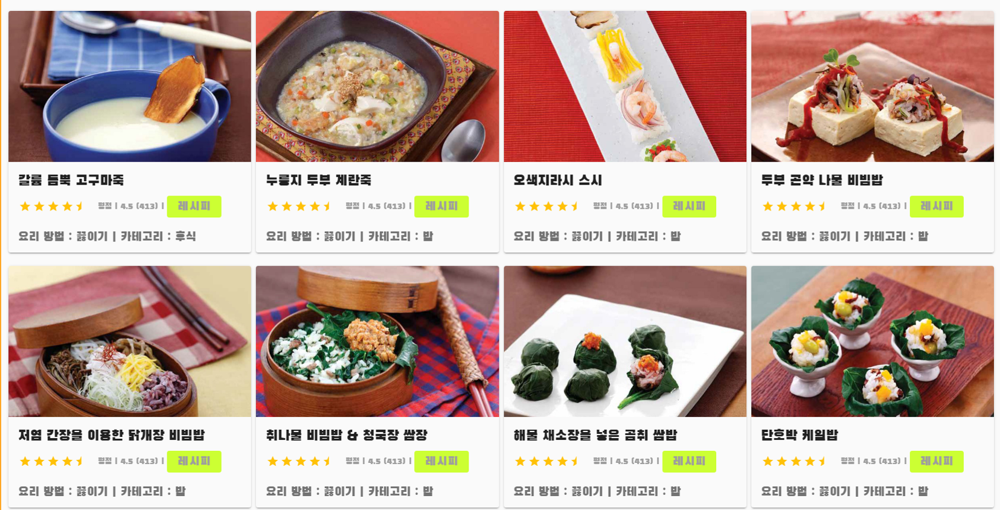
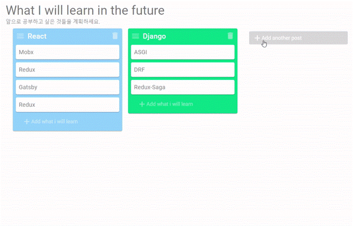

# 코드비공개 프로젝트

#### Recipe Studio(DjangoRestFramework+vue.js, 2020.03~, 6주)

---

제철음식을 활용하는 레시피를 큐레이션 서비스입니다. 아직 미완성/현재진행중인 프로젝트입니다.

팀원: 6명

담당역할: 백엔드 전반

백엔드는 2명에서 진행하고 있으며, 인증과 배포를 제외한 백엔드의 모든걸 하고있습니다.(2명은 추천알고리즘, 2명은 프론트앤드)

리뷰, 평점, 제철음식 여부에 따라 협업필터링 알고리즘과 하이브리드 추천 알고리즘을 사용하여 추천할예정입니다.

#### Today I learned(Spring+React.js, 2020.1~2020.2,6주)

---

#### 영화추천 사이트(Django Restframework+Vue.js, 2019.11, 1주)

---

#### 데이터분석 프로젝트(2018.05~06, 7주)

---

서울대학교 빅데이터연구원 협약기업과 진행

팀원: 4명

기여도: 40%

역할: 전반적인 스켈레톤 코드 구성 - 전처리, 분석, 결과 Visualize

의료데이터 분석

기존에 위험도를 측정할때 룰베이스로 하였던것을(체온, 심박수 등의 바이탈 수치의 범위에 따라 위험도 점수를 주고 일정 위험도 이상일때 경고) 머신러닝, 딥러닝(RNN - LSTM, GRU)을 통해 분석

12시간/24시간 내 사고 확률 판단 - 딥러닝으로 할 시에 가장 정확도가 높음을 증명

